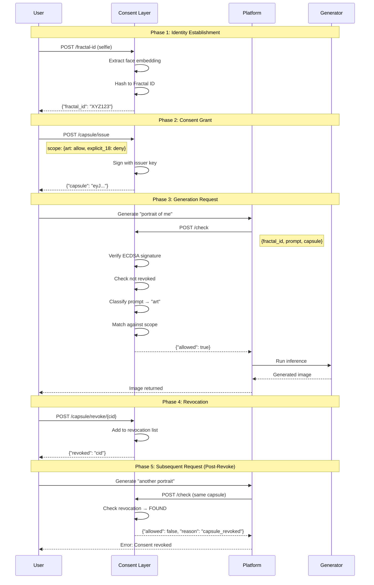
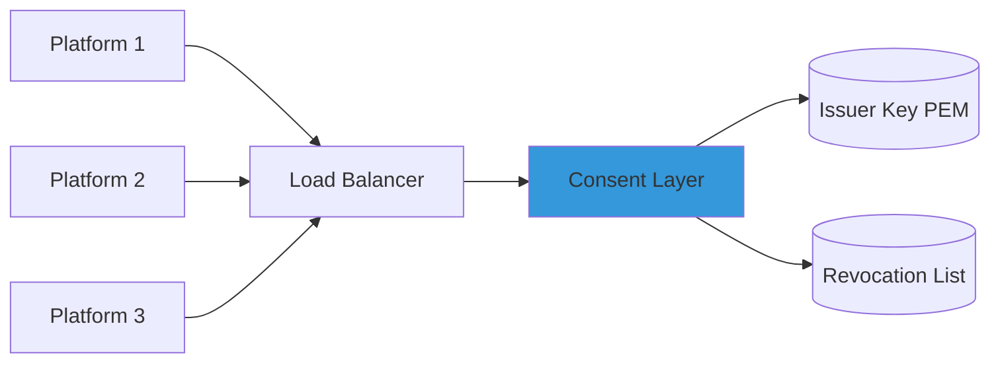
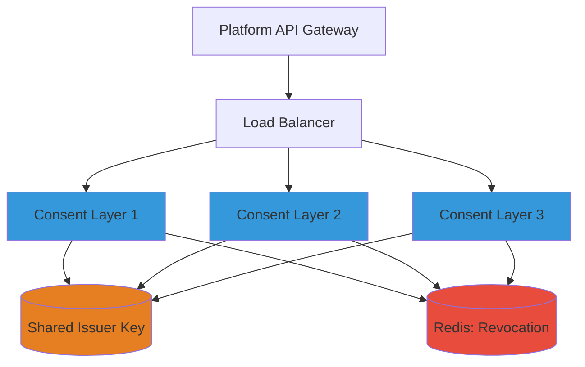
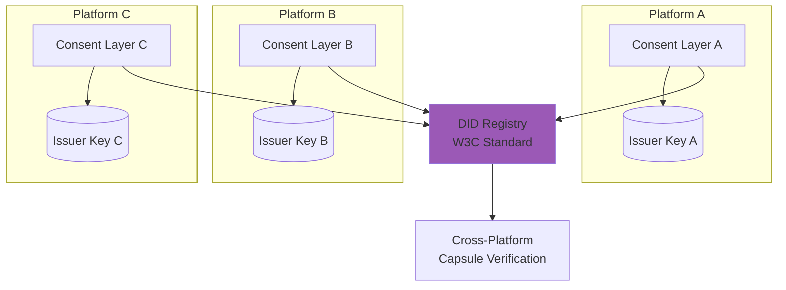
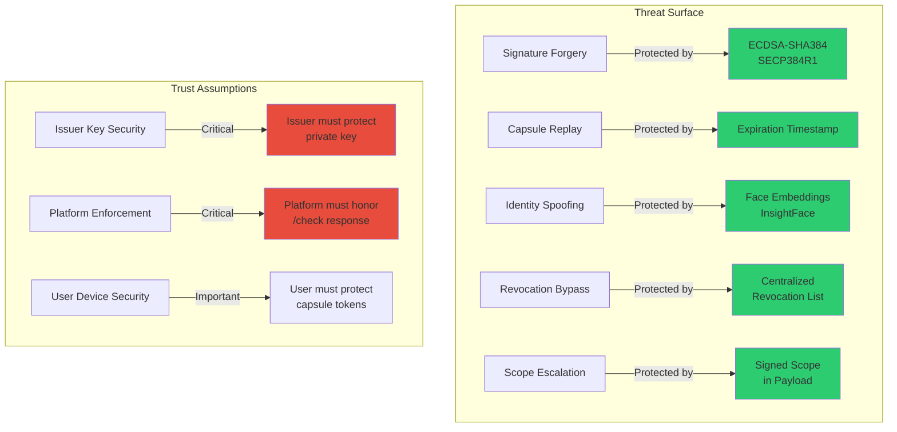
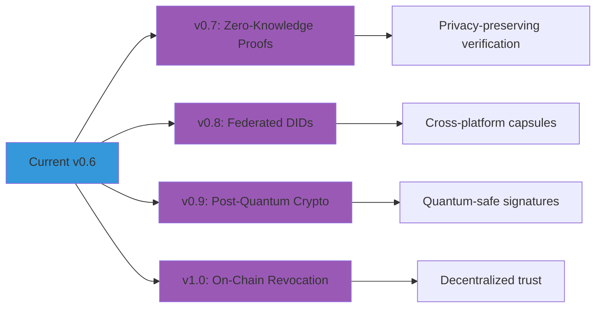

# Architecture Overview

## System Architecture

This document provides a visual reference for the X Identity Shield consent layer architecture, data flows, and cryptographic primitives.

---

## High-Level Flow

```mermaid
graph TB
    User[👤 User] -->|1. Upload selfie| FractalID[Fractal ID Generation]
    FractalID -->|BLAKE2s hash of face embedding| ID[Fractal ID: XYZ123...]
    
    User -->|2. Issue consent| Capsule[Capsule Issuance]
    ID --> Capsule
    Capsule -->|ECDSA-SHA384 signature| Token[Signed Capsule Token]
    
    User -->|3. Request generation| Platform[Image Generation Platform]
    Platform -->|Check consent| Enforcement[/check Endpoint]
    Token --> Enforcement
    ID --> Enforcement
    
    Enforcement -->|Verify signature| Crypto[Cryptographic Verification]
    Enforcement -->|Check revocation| Revocation[(Revocation List)]
    Enforcement -->|Match scope| Scope[Scope Enforcement]
    
    Scope -->|ALLOW| Generator[🎨 Image Generator]
    Scope -->|DENY| Block[❌ Block Generation]
    
    Generator -->|Output| Image[Generated Image]
    Block -->|Error + Reason| User
    
    User -->|4. Revoke consent| Revoke[/capsule/revoke]
    Revoke --> Revocation
    
    style FractalID fill:#4A90E2
    style Capsule fill:#4A90E2
    style Enforcement fill:#E74C3C
    style Generator fill:#2ECC71
    style Block fill:#E74C3C
```

---

## Detailed Component Architecture

```mermaid
graph LR
    subgraph Client Side
        A[User Device] -->|Selfie| B[/fractal-id API]
        A -->|Consent params| C[/capsule/issue API]
    end
    
    subgraph Consent Layer
        B --> D[Face Recognition]
        D -->|InsightFace model| E[512-dim embedding]
        E -->|BLAKE2s| F[Fractal ID]
        
        C --> G[Issuer Private Key]
        G -->|ECDSA-SHA384| H[Signed Capsule]
        
        I[/check API] --> J{Validate Capsule}
        J -->|Invalid sig| K[DENY: invalid_capsule]
        J -->|Valid| L{Check Revocation}
        L -->|Revoked| M[DENY: capsule_revoked]
        L -->|Active| N{Match Scope}
        N -->|Out of scope| O[DENY: category_denied]
        N -->|In scope| P[ALLOW: consent_granted]
    end
    
    subgraph Platform
        Q[Image Generator] -->|Before gen| I
        P --> Q
        K --> R[Return Error]
        M --> R
        O --> R
    end
    
    style D fill:#9B59B6
    style G fill:#E67E22
    style J fill:#F39C12
    style L fill:#F39C12
    style N fill:#F39C12
```

---

## Cryptographic Primitives

```mermaid
graph TD
    subgraph Identity Layer
        A[Selfie Image] -->|InsightFace| B[Face Embedding<br/>512 floats]
        B -->|Serialize| C[Binary Blob<br/>2048 bytes]
        C -->|BLAKE2s-256| D[Fractal ID<br/>32 bytes]
        D -->|Base64url| E[Fractal ID String<br/>43 chars]
    end
    
    subgraph Capsule Structure
        F[Payload JSON] -->|Stringify| G[Payload Bytes]
        G -->|BLAKE2s-256| H[Digest<br/>32 bytes]
        H -->|ECDSA-SHA384| I[Signature<br/>96 bytes]
        G -->|Base64url| J[Payload B64]
        I -->|Base64url| K[Signature B64]
        J --> L[Token: payload.signature]
        K --> L
    end
    
    subgraph Verification
        M[Received Token] -->|Split on '.'| N[Payload B64]
        M --> O[Signature B64]
        N -->|Decode| P[Payload Bytes]
        O -->|Decode| Q[Signature Bytes]
        P -->|BLAKE2s-256| R[Recompute Digest]
        Q -->|ECDSA-SHA384| S[Verify Signature]
        R --> S
        S -->|Public Key| T{Valid?}
        T -->|Yes| U[Extract Scope]
        T -->|No| V[Reject]
    end
    
    style B fill:#3498DB
    style H fill:#E74C3C
    style I fill:#E74C3C
    style S fill:#2ECC71
```



---

## Consent Capsule Anatomy

```
┌─────────────────────────────────────────────────────────────┐
│                    Consent Capsule Token                     │
│                                                              │
│  Format: {payload_b64}.{signature_b64}                       │
└─────────────────────────────────────────────────────────────┘

┌──────────────────────────────────┐
│         Payload (JSON)           │
├──────────────────────────────────┤
│ iss: "did:key:..."              │ ← Issuer DID (public key)
│ sub: "XYZ123..."                │ ← Fractal ID (subject)
│ scope: {                        │
│   "art": "allow",               │ ← Granular permissions
│   "erotic": "deny",             │
│   "explicit_18": "deny"         │
│ }                               │
│ iat: 1703001234                 │ ← Issued at (timestamp)
│ exp: 1703004834                 │ ← Expires (timestamp)
│ cid: "uuid-v4"                  │ ← Capsule ID (for revocation)
└──────────────────────────────────┘
          │
          ▼ (BLAKE2s hash)
┌──────────────────────────────────┐
│     32-byte Digest               │
└──────────────────────────────────┘
          │
          ▼ (ECDSA-SHA384 sign)
┌──────────────────────────────────┐
│     96-byte Signature            │
│  (SECP384R1 curve, r + s)        │
└──────────────────────────────────┘
```

---

## Data Flow: Complete Lifecycle



---

## Scope Enforcement Logic

```mermaid
graph TD
    A[Prompt Received] --> B{Contains explicit terms?}
    B -->|Yes| C[Category: explicit_18]
    B -->|No| D{Contains erotic terms?}
    D -->|Yes| E[Category: erotic]
    D -->|No| F[Category: art]
    
    C --> G{Capsule scope?}
    E --> G
    F --> G
    
    G -->|explicit_18: allow| H[ALLOW]
    G -->|explicit_18: deny| I[DENY: explicit_18_generation_denied]
    G -->|erotic: allow| H
    G -->|erotic: deny| J[DENY: erotic_generation_denied]
    G -->|art: allow| H
    G -->|art: deny| K[DENY: art_generation_denied]
    G -->|Not specified| L[DENY: {category}_generation_denied]
    
    style H fill:#2ECC71
    style I fill:#E74C3C
    style J fill:#E74C3C
    style K fill:#E74C3C
    style L fill:#E74C3C
```

**Keyword Sets:**

- **Explicit:** `nude`, `naked`, `nsfw`, `porn`, `sex`, `explicit`, `bare`, `uncensored`, `topless`, `bottomless`, `genital`, `x-rated`
- **Erotic:** `lingerie`, `bikini`, `sensual`, `erotic`, `seductive`, `bedroom`, `boudoir`
- **Art:** Everything else (default)

---

## Deployment Architectures

### Single-Instance Deployment



### High-Availability Deployment



### Federated Network (Future)



---

## Security Model



---

## Performance Profile

```
┌──────────────────────────────────────────────────────────────┐
│                 Endpoint Latency (p50)                        │
├──────────────────────────────────────────────────────────────┤
│  /fractal-id       ████████████████ 150ms (face detection)   │
│  /capsule/issue    █ 2ms (ECDSA sign)                        │
│  /check            █ 0.5ms (verify + scope match)            │
│  /capsule/revoke   █ 1ms (append to file)                    │
└──────────────────────────────────────────────────────────────┘

┌──────────────────────────────────────────────────────────────┐
│                  Memory Footprint                             │
├──────────────────────────────────────────────────────────────┤
│  Reference Spec:   ███ 50 MB (no ML models)                  │
│  Production:       ████████████ 520 MB (InsightFace loaded)  │
└──────────────────────────────────────────────────────────────┘
```

---

## Cryptographic Strength

| Primitive         | Algorithm        | Key Size | Security Level |
|-------------------|------------------|----------|----------------|
| Face ID Hashing   | BLAKE2s          | 256-bit  | 128-bit        |
| Capsule Signing   | ECDSA            | 384-bit  | 192-bit        |
| Curve             | SECP384R1 (P-384)| 384-bit  | 192-bit        |
| Digest (capsule)  | SHA-384          | 384-bit  | 192-bit        |

**Resistance:**
- Quantum resistance: ❌ (ECDSA vulnerable to Shor's algorithm)
- Collision resistance: ✅ (2^128 for BLAKE2s)
- Forgery resistance: ✅ (2^192 for ECDSA)

**Post-Quantum Migration Path:** Replace ECDSA with Dilithium (NIST PQC standard)

---

## API Contract Summary

### Endpoints

| Endpoint                    | Method | Auth | Purpose                          |
|-----------------------------|--------|------|----------------------------------|
| `/fractal-id`               | POST   | None | Generate biometric identity      |
| `/capsule/issue`            | POST   | None | Issue signed consent token       |
| `/check`                    | POST   | None | Verify consent before generation |
| `/capsule/revoke/{cid}`     | POST   | None | Revoke existing capsule          |

### Response Codes

- `200 OK` - Success
- `403 Forbidden` - Consent denied
- `422 Unprocessable Entity` - Invalid request
- `500 Internal Server Error` - System failure

---

## Design Principles

1. **Cryptographic Enforcement** - Trust math, not promises
2. **Default Deny** - No consent = no generation
3. **Instant Revocation** - User retains control
4. **Generator Agnostic** - Works with any image model
5. **Minimal Trust Surface** - Only issuer key is critical
6. **Auditable** - All denials logged with reasons
7. **Portable** - Standard REST API, no vendor lock-in

---

## Future Enhancements



---

## System Guarantees

✅ **Guaranteed:**
- Valid signature → consent was granted by issuer
- Revoked capsule → always denied (no exceptions)
- Expired capsule → always denied
- Scope mismatch → always denied

❌ **NOT Guaranteed:**
- Platform will honor `/check` response (trust required)
- User device security (capsule theft possible)
- Face liveness detection (photo-of-photo attack)
- Legal compliance in your jurisdiction

---

This architecture is designed to be **simple, secure, and universal**. It does one thing well: cryptographic consent enforcement.
